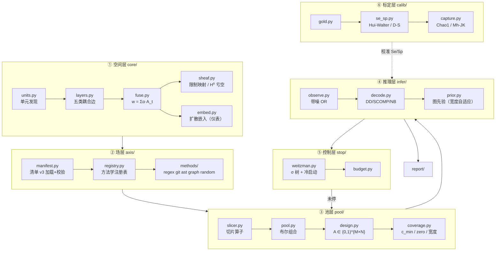

# ToposAudit 架构设计书

> **项目**：ToposAudit（拓扑审计）— 把"代码审计"重定义为"在一个拓扑空间上做统计最优的缺陷检出"
> **版本**：v0.1-draft ｜ **日期**：2026-10-09 ｜ **状态**：设计草案，待裁决项见 §15
> **血缘**：`audit-lab`（方法论工程，只读）→ `mini-lab`（最小工程实验件，已冻结为证据）→ **本文件（正式项目）**
> **License**：MIT

## 证据标记（全文强制）

本设计书不允许出现"想当然的架构"。每一条设计主张必须带一个标记：

| 标记 | 含义 | 可信度 |
|---|---|---|
| **[M]** 实测背书 | mini-lab 里跑出来过，有 `EXP*.md` 回执 | 高，可写进代码 |
| **[T]** 理论背书 | 有文献/定理支撑，本机未跑 | 中，写进代码但需实验确认 |
| **[U]** 未验证 | 设计推断，无实测无定理 | 低，**只能写成可替换的接口，不能写成硬编码策略** |

> 纪律：凡 [U] 落地时，必须同时预注册一个能证伪它的判据。否则不许合入主干。

---

## 0. 决策摘要（一页）

| # | 决策 | 结论 | 证据 |
|---|---|---|---|
| D1 | 空间本体是什么 | **五类耦合边多层图**（call/data/control/return/vardep）+ 融合图，不是向量空间 | [M] space_mini 10/10 |
| D2 | 坐标轴是什么 | **图上的标量场/标签场**，**不是空间的维度**；维度只在嵌入层临时出现 | [U] ← 修正 v0.2 的混淆 |
| D3 | 池是什么 | 设计矩阵 `A ∈ {0,1}^{M×N}` 的**任意行**，允许重叠 | [M] 硬排除漏检 8.8× |
| D4 | 阴性池怎么用 | **不硬排除**，走后验解码 | [M] 同上 |
| D5 | 四层解耦 | 场 → 切片 → 池 → 设计矩阵，四层各自独立可替换 | [U] 设计决策（本设计书最重要的一条） |
| D6 | 清单单源 | 引擎只认**方法学**（regex/git/ast/graph/…），不认轴名；加轴=改清单不改代码 | [M] 解耦验收 11/11 |
| D7 | 导航嵌入的地位 | **降级为仪表**（可视化/距离查询），不承担池设计 | [M] E-X1 v3/v4 双判据不咬合 |
| D8 | 盲区谁负责 | **sheaf**：H⁰ 亏空 = 不可拼接的证词；边级残差定位 | [M] 10/10，TV 对照 2/10 |
| D9 | 停止规则 | Weitzman σ 树 + 闭式冷启动，不是拍脑袋定下钻数 | [T] Weitzman 1979 |
| D10 | 依赖策略 | 零第三方依赖优先；谱分解手写 Lanczos | [M] N=2000 λ₂ 残差 1e-7 / 2.2s |
| D11 | M1 的硬前置 | **金标 300–500**（人工核实单元），否则 Se/Sp 全是拍定口径 | [T] Hui–Walter / Dawid–Skene |

**一句话**：ToposAudit 不是"又一个扫描器"，是一台**在拓扑空间上分配审计注意力的机器**——它输出的不是"有 bug"，而是"在给定预算下，下一份注意力该投在哪，以及投完之后还剩多少不知道"。

---

## 1. 问题定义与非目标

### 1.1 人话版

你有一万行不熟的代码，两小时。你要回答三个问题：哪里最可能有问题？我已经看了这些地方，还差多少？我现在可以停了吗？

现在所有工具只回答第一个，而且答得像算命——一堆告警，不知道漏了多少，不知道看到什么程度算够。

ToposAudit 想把这三个问题都变成**有读数、有误差棒、有停止条件**的量。

### 1.2 形式化

- 代码被切成 **N 个单元**（函数/方法，N ≈ 10³–10⁵）；
- 单元之间有 **五类耦合关系**，构成底空间 `G = (V, E₁..E₅)`；
- 审计动作不是"看一个单元"，而是**对一个单元子集（池）做一次整体判定** `y ∈ {0,1}`，判定带噪（灵敏度 Se / 特异度 Sp）；
- M 次判定构成设计矩阵 `A ∈ {0,1}^{M×N}` 与观测向量 `y ∈ {0,1}^M`；
- 求解：后验 `P(单元 i 有缺陷 | A, y)`；
- 控制：在预算 B 内，用最优停止决定"还打不打下一发池"。

### 1.3 非目标（明确不做）

| 不做 | 理由 |
|---|---|
| 不做漏洞利用 / PoC 生成 | 我们回答"在哪"，不回答"怎么打" |
| 不追求零误报 | 误报率与召回率是可调的权衡，由预算与代价函数决定，不由系统拍板 |
| 不替代人工终审 | 系统是**注意力分配器**，不是裁决者 |
| 不做跨仓库的通用漏洞库匹配 | 那是 CVE 匹配，不是本项目的命题 |
| **不造第二个引擎** | 机制唯一：同一件事只有一个实现，禁止平行分支（§11） |

---

## 2. 核心命题与三条立论

**核心命题：一个 bug 的影响区域必然跨坐标系。**

意思是：缺陷不是"某一行代码的属性"，它是**多个描述系统之间的失配**。命名规范说它没问题，数据流说它有问题，调用关系说这两个东西根本不该在同一个模块里。单个视角永远看不见，因为每个视角各自都自洽。

三条立论：

**立论 1：池不是格子的划分，是设计矩阵的任意行，且允许重叠。** [M]
格子划分（每个单元只属于一个桶）在数学上是 group testing 里最差的设计——它浪费了"一次判定能覆盖多个单元"的信息。允许重叠后，一次阴性判定能同时压低池内所有单元的后验。实测：真实空间上硬排除的漏检是后验解码的 **8.8×**（合成仓 3.4×，[M] D1）。

**立论 2：阴性不硬排除，走后验。** [M]
带噪 OR 观测模型下，"池阴性"只说明"池内大概率没有"，不说明"每个单元都没有"。硬排除把概率当布尔，代价就是上面那个 8.8×。

**立论 3：审到哪算够 = 最优停止。** [T]
Weitzman (1979) 的 Pandora 盒子：每个候选池是一个盒子，打开有代价 c，价值 w 未知。最优策略是算一个保留值 σ，按 σ 降序开，σ 低于当前最优就停。冷启动有闭式解。这是本项目区别于"跑完扫描器再人工排"的根本：**预算是内生的，不是外挂的**。

---

## 3. 空间本体论

### 3.1 底空间：五类耦合边多层图

这是"多维拓扑图空间"里**唯一的本体**。"多维"指的是**多层（multi-layer）**，不是"每个单元是一个 K 维向量"。

| 层 | 边类型 | 语义 | 血统 |
|---|---|---|---|
| `call` | 调用 | f 调用 g | 调用图 |
| `data` | 数据流 | g 的返回值流入 h（含跨函数值穿越） | SCN |
| `control` | 控制依赖 | g 的结果决定 h 是否执行 | SCN |
| `return` | 返回耦合 | 二者向同一调用者返回 | SCN |
| `vardep` | 变量依赖 | 共享模块级可变状态 | SCN |

**融合图**：`w(e) = Σ_t α_t · 1[e ∈ E_t]`，`α` 由清单的 `layers` 段给出，默认全 1.0。

为什么必须是多层而不是一层：单层调用图会把"两个函数从不相干但共享一个全局变量"这种关系整个丢掉，而这类关系恰恰是接缝型缺陷的位置。

[M] 实测（mini-lab 自身，N=65）：

```
五类耦合边: call=76  data=70  control=1  return=2  vardep=25
融合图边 = 104，其中 28 条（27%）不在 call 层  ← 这就是"多维"的增量
```

**同一条实测暴露的问题**：`control=1`、`return=2`，几乎抽不出来。控制依赖与返回耦合在函数级 + 简单名解析的近似下严重欠采——这是当前抽取器的真实天花板，不是调参问题。M5 引入 Joern 校验时，`control` / `return` 的召回是首要校验对象。

**单元发现**：函数/方法粒度，AST 驱动。多语言后端见 §9.2 `core/units.py`。

### 3.2 sheaf 层：限制映射与盲区证词

cellular sheaf 给每个节点一个**stalk**（局部状态空间）、每条边一个**限制映射** `s_e`（把一端的状态翻译到另一端的规则）。

- 上链复形余边界：`(Bz)_e = z_v − s_e · z_u`
- sheaf Laplacian：`L = BᵀB`
- `ker L = H⁰`（全局截面 = 能全局自洽拼起来的赋值）
- **H⁰ 亏空 = 存在无法全局拼接的局部一致性 → 这就是"盲区"的证词**

实测 [M] X5a：10/10 试验中，frustrated（有矛盾）配置的 `ker = 0`，干净配置 `ker = 1`。
实测 [M] X5b：边级残差 10/10 达到 100% 定位率。
实测 [M] X5c：TV（全变差）对照只有 2/10——**TV 对符号矛盾是结构性看不见的**，因为它只 penalize 差值大小，不看方向。

**当前限制**：原型里 `s_e ∈ {+1, −1}`（d=1 符号层）。真实语义（如 `declassify` / `endorse` / `sanitize` 之间的转换规则）需要从 A 轴工单（§13 M4）里长出来。[U]

### 3.3 嵌入层（导航几何）：降级说明

扩散嵌入的距离 = 传播时间，理论上很美：两个单元在图上"多快能互相影响"，就是它们的距离。实现用 Lanczos（m=80，全重正交化），[M] N=2000 上 λ₂ 残差 1e-7 / 2.2s。

**但是**：E-X1 用四版预注册实验测"扩散嵌入指导的池是否比随机池更能检出缺陷"，**不咬合**。零覆盖率从 11.5% 压到 0%（机制修复成功），但簇臂召回反而 −19.6pp。

结论：**覆盖均衡 ≠ 检测最优**。嵌入坐标因此降级为**仪表**——用来画图、用来查"谁离谁近"，不用来决定池怎么打。[M]

这条是本设计书里最贵的一条：一个看起来最"高级"的部件，被实测降级了。保留它，是因为它仍然提供可视化与邻接查询，但它的输出**不进入控制回路**。

### 3.4 层间契约

| 从 → 到 | 传递什么 | 契约 |
|---|---|---|
| 代码 → 底空间 | `Space{units, layers, fused, adj}` | units 编号稳定（一次建空间内不变） |
| 底空间 → 场 | `Field: unit_id → value \| None` | **None 是合法值，表示"该轴在此单元上无定义"**，禁止填 0 |
| 场 → 切片 | `Slicer: Field → Set[unit_id]` | 切片不产生 None，只产生集合（可空） |
| 切片 → 池 | `Pool: Set[unit_id]`（可布尔组合） | 池不得为空；空池在设计矩阵构建时丢弃 |
| 池 → 设计矩阵 | `A ∈ {0,1}^{M×N}` | 必须输出 `c_min / zero_cover_rate / 宽度分布` 三诊断 |
| 设计矩阵 + 观测 → 后验 | `Belief: unit_id → [0,1]` | 只输出概率，**禁止在解码层输出二值判定** |

---

## 4. 坐标轴系统（本设计书的核心修正）

### 4.1 轴不是维度，是场

这是 v0.2 里最严重的一个概念混淆，正式项目必须修掉。

v0.2 的 `axes.json` 里，"轴"同时干了三件事：声明怎么算一个值（`method: git`）、声明怎么切（`pool: tercile_neg`）、声明了池本身。三者焊死在一个字典里，结果是：

- 同一个 churn 值不能再切第二种切法（想同时要 `churn:top` 和 `churn:mid`，得在代码里加分支）；
- 不能表达"锚点 = eval **且** churn 高的交集池"；
- 加轴必须懂引擎代码，违背 D6。

**正式定义**：

> **轴 = 底空间上的一个场（field）**：映射 `f: Unit → Value ∪ {None}`。它是一个**描述**，不是一个方向。
> **切片 = 场上的一个算子**：`Slicer(f) → Set[Unit]`。
> **池 = 切片的布尔组合**。
> **设计矩阵的行 = 池**。

于是"多维"的真相是：**空间本身没有维度，维度是临时从场上切出来的**。这直接回答了"代码的几个坐标轴要怎么拓扑到多维空间"——**它们不拓扑成维度，它们是定义在同一个图上的多个场，经切片后共同生成池空间**。这个改法让"加一个轴"和"换一种切法"变成两件独立的事。

### 4.2 四层解耦

```
  底空间（图）
      │
      ▼
  ┌─────────┐   axes.json: fields[]    引擎只认 method
  │  场     │   anchor / churn / loc / forman / diffusion / …
  └────┬────┘
       │     axes.json: slicers[]      阈值/分位/成员判定
       ▼
  ┌─────────┐
  │  切片   │   churn:top  anchor:eval  forman:confluence
  └────┬────┘
       │     axes.json: pools[]        布尔组合 AND/OR/NOT
       ▼
  ┌─────────┐
  │   池    │   p_hot_eval = anchor:eval AND churn:top
  └────┬────┘
       ▼
  ┌─────────┐   输出必带三诊断
  │设计矩阵 │   c_min / zero_cover_rate / 宽度分布
  └─────────┘
```

四层各自可替换，任一层改动不波及其它三层。这是 D5，也是本项目可维护性的根基。

### 4.3 清单 schema v3

```json
{
  "version": 3,
  "layers": {"call": 1.0, "data": 1.0, "control": 1.0, "return": 1.0, "vardep": 1.0},
  "fields": [
    {"name": "anchor",    "layer": "L", "method": "regex", "params": {}},
    {"name": "churn",     "layer": "T", "method": "git",   "params": {"metric": "commits"}},
    {"name": "loc",       "layer": "L", "method": "ast",   "params": {"metric": "lines"}},
    {"name": "forman",    "layer": "G", "method": "graph", "params": {"formula": "forman_unweighted"}},
    {"name": "diffusion", "layer": "G", "method": "graph", "params": {"k": 3}},
    {"name": "random",    "layer": "-", "method": "random","params": {"seed": 20261009}}
  ],
  "slicers": [
    {"name": "anchor:eval",       "field": "anchor",  "op": "has",          "value": "eval"},
    {"name": "anchor:*",          "field": "anchor",  "op": "expand"},
    {"name": "churn:top",         "field": "churn",   "op": "quantile_gt",  "q": 0.67},
    {"name": "churn:mid",         "field": "churn",   "op": "between_q",    "q_lo": 0.33, "q_hi": 0.67},
    {"name": "forman:confluence", "field": "forman",  "op": "quantile_le",  "q": 0.33},
    {"name": "big",               "field": "loc",     "op": "gt",           "value": 60}
  ],
  "pools": [
    {"name": "p_hot_eval",     "expr": {"all": ["anchor:*", "churn:top"]}},
    {"name": "p_confluence",   "expr": "forman:confluence"},
    {"name": "p_big_or_hot",   "expr": {"any": ["big", "churn:top"]}}
  ],
  "constraints": {"max_width": 60, "max_pools": 64, "min_pool_size": 3}
}
```

变更点：v0.2 的 `axes[]` 拆成 `fields[] + slicers[] + pools[]`；`pool` 参数从轴声明里移除；新增 `constraints`（把 §5.3 的宽度平衡条款**工具化**——REPORT §4 第 4 条"条款已实测，工具未实现"，这里补上）。池的布尔组合用 **JSON 原生嵌套结构**（`{"all":[]}/{"any":[]}/{"not":…}`，叶子=切片名）而非字符串 DSL——零解析器、无优先级歧义（ADR-A10）。切片算子含 `expand`（把列表场的每个取值自动展开成一片，33 个 bandit 锚点 tag 免手写 33 条声明，ADR-A11）。

### 4.4 方法学注册表（D6 的实现）

引擎只认 `method` 字符串，通过装饰器注册：

```python
FIELD_METHODS = {}
def field_method(name):
    def deco(fn): FIELD_METHODS[name] = fn; return fn
    return deco

@field_method("regex")
def regex_field(units, params, ctx) -> Field: ...
@field_method("git")
def git_field(units, params, ctx) -> Field: ...
```

**解耦验收判据**（沿用 v0.2 的 selftest 条款）：仅修改 `axes.json` 新增一个场 + 一个切片 + 一个组合池，引擎零代码改动即可产出该池。这条判据进 CI，破了就是回归。[M] v0.2 已 11/11 通过同构验收。

命名纪律：注册函数**不得**与标准库模块同名（v0.2 踩过 `def random(...)` 遮蔽 `random` 模块的事故，见 REPORT §3）。统一后缀 `_field`。

### 4.5 轴准入三准则

| 准则 | 内容 | 类型 |
|---|---|---|
| 信息互补 | 新轴加入后 Fisher 信息矩阵行列式增量达阈值才准入；轴间似然相关 \|ρ\|<0.3 只是**初筛**不是准入 | 可算化（M2 落地） |
| 结构正交 | 信号必须来自**不同工件类型**（语法 / 配置 / 协作 / 历史）；同源必相关，相关即假共识 | 人工判据 |
| 尺度分层 | L 局部 / G 全局 / **T 时间**；T 层最易漏，每加一个 L 轴必须问一次 T 轴有没有跟上 | 人工判据 |

**T 层（时间维）单独说**：用户明确点过"时间维度呢"。时间不是一个场，是**一族场**：churn（改了多少次）、age（多久没动）、作者分散度、缺陷修复耦合（同一 commit 修复的两个文件是否相关）、演化稳定性。v0.2 只实现了 churn + age 两个，其余是 M2 的工单。git CLI 缺失时必须**如实降级**（值 = None），不允许填 0 假装。[M] E-T3 churn 轴精确恢复 8/1 commits。

---

## 5. 池与设计矩阵（群验层）

### 5.1 什么算"一次判定"

这是最容易被误解的地方。一次池判定 = **任意一个"对一批单元给出整体判断"的信号源**：

| 信号源 | 判定内容 | Se/Sp 现状 |
|---|---|---|
| 人工扫读（5 分钟看 20 个函数） | "这批里有我看着不对的吗" | 未知，需金标 |
| LLM 批量审 | "这批里有疑似缺陷吗" | 未知（文献：balanced acc 0.5–0.63 [T]） |
| 单元测试 / fuzz 崩溃归属 | 崩溃栈落在这批里吗 | 较高 Se，低 Sp |
| 静态分析告警聚合 | 这批里有没有告警 | 已知偏低 Sp |
| 运行期监控 | 异常率是否上升 | 场景依赖 |

只要能给出"有/没有"，就能当一行设计矩阵用。**这是 ToposAudit 能吃下异构证据的关键**——它不要求所有证据同构，只要求每个证据声明自己的 Se/Sp。

### 5.2 观测模型

带噪 OR：`y_j = 1` 当且仅当池 j 内至少一个单元有缺陷 **且** 该判定本身没漏（Se），或池内无缺陷但误报（1−Sp）。

```
P(y_j = 1 | D_j) = 1 − Sp + (Se + Sp − 1) · OR_{i ∈ pool_j} d_i
```

其中 `d_i ∈ {0,1}` 是单元真值。

### 5.3 池设计三难（实测条款）

| 条款 | 内容 | 证据 |
|---|---|---|
| 覆盖均衡法则 | 零覆盖单元是解码下限的毁灭者——球池零覆盖 11.5% 时散布缺陷**不可检出** | [M] E-X1 |
| 宽度平衡法则 | 切片池过宽 → 证据过泛 → 图先验失效（阳性并集罩 93.7%） | [M] decode run1 |
| 覆盖均衡 ≠ 检测最优 | FPS 均衡池把零覆盖压到 0%，簇臂召回反 −19.6pp | [M] E-X1 v4 |

**三难**：零覆盖 / 宽度 / 空间均衡 vs 簇集中。四个目标不能同时最大化。

设计决策：**不在引擎里硬编码一个"最优"池生成器**（这是 [U]，谁都不知道最优是什么）。改为：
1. 引擎提供**若干生成器**（切片池 / FPS 球池 / kNN 池 / 随机池 / 组合池），可插拔；
2. 每次出池**强制输出三诊断**（`c_min`、`zero_cover_rate`、宽度分布），诊断不达标就报警；
3. 具体选哪个生成器，交给**控制层的代价函数**（§7）+ 实测，不由架构拍板。

这条对齐 [U] 纪律：未验证的策略只做接口，不做硬编码。

---

## 6. 推理层：解码

### 6.1 解码器族

| 解码器 | 原理 | 状态 |
|---|---|---|
| COMP | 凡出现在阴性池里的一律判无缺陷 | 基线（= 硬排除），保留仅作对照 |
| DD | 阳性池中只出现一次的单元判有缺陷 | [T] 标准算法，M2 实现 |
| SCOMP | DD 之后解释残余阳性池 | [T] 标准算法，M2 实现 |
| naive-Bayes 后验 | 逐单元独立后验，用 Se/Sp 与池成员关系 | [M] 已实现（decode_mini），真仓 8.8× |
| NB + 图先验 | 后验上加 TV / 扩散平滑 | [M] 已实现，增益有限 |
| sheaf 残差 | H⁰ 亏空 + 边级残差，专治"数值一致但语义矛盾" | [M] 10/10 |

**输出纪律**：解码层**只输出概率**。二值化（取阈值）是下游的事，阈值由代价函数决定，不由解码器决定。

### 6.2 图先验的适用范围条款（实测夹出来的）

> **图先验（TV / 扩散）救"证据太弱"，不救"证据太泛"。**

两链夹出：E5 随机稀疏池 +10~23pp（正例：证据弱，图结构补得上）[M]；decode D2/D2' 真实宽切片池 ≤1pp（反例：证据已经泛到罩住 93.7%，图结构补不上）[M]。

落地：图先验强度必须**按池宽度自适应**——宽池自动减弱先验，窄池才允许强先验。这条要写成 `infer/prior.py` 的默认行为，且进 M2 的预注册验证。

### 6.3 不平衡场景的评估纪律

事故教训 [M]：accuracy 被 FPR 主导，导致"全判无缺陷"看起来很准。
**强制**：所有解码评估必须同时报 AUC（排序质量，无阈值）与平衡准确率；准确率只在类别平衡时有意义。

---

## 7. 控制层：最优停止

### 7.1 Weitzman σ 树 [T]

每个候选池是一个 Pandora 盒子：打开代价 c_j，价值 w_j 未知（分布已知）。

保留值 σ_j 定义为使"打开它"与"直接拿 σ_j 走人"无差异的那个值：

```
E[(w_j − σ_j)⁺] = c_j
```

最优策略：按 σ 降序开盒，一旦已开出的最大 w 超过所有剩余 σ，就停。

### 7.2 冷启动闭式解 [T]

首轮无信息时，σ 有闭式起点（指数族假设下 `σ = w − c/θ`），不需要数值求解。这让 M0 就能跑，不用等 M3 的完整 Snell 包络。

### 7.3 已知退化 [T]

池**相关**时（本项目必然相关——池是从同一张图上切出来的），Weitzman 最优性退化，已知近似界 4.428。

设计含义：**不要承诺最优**，承诺"优于固定深度下钻基线"。M3 的验收判据就是模拟仓上的预算-召回曲线对比，不是理论最优性。

### 7.4 控制回路

```
观测 y → 解码 → 后验 Belief
                    │
         ┌──────────┴──────────┐
         ▼                     ▼
   候选池 σ 重算          停止判据
         │                     │
    σ 最高者 = 下一发      停 → 输出报告
```

---

## 8. 标定层（M1 硬前置）

**现状的诚实声明**：mini-lab 里所有 Se/Sp 都是**拍定口径**。因此所有精度读数都是"仪器灵敏度"，不是"真实精度"。**这是整个项目最大的天花板。**

三阶段路线 [T]：

| 阶段 | 方法 | 需要什么 |
|---|---|---|
| 1 小金标 | 人工核实 300–500 单元 → 直接估 Se/Sp | 人力（A8 工单） |
| 2 无金标放大 | Hui–Walter 潜类 / Dawid–Skene 多标注者一致性 | ≥2 个独立信号源 + ≥2 个群体 |
| 3 捕获-再捕获 | Chao1 / Mh-JK 估"还剩多少没找到" | 多轮独立池判定 |

额外机制 [T]：
- **Ising W 矩阵**建模标注者"假共识"（两个标注者被同一个偏见带偏，一致性高但都错）；
- **git churn 先验**（Nagappan–Ball 判别力 89%）+ Graves 收缩，作为缺陷密度的经验先验；
- 温度 / Platt 缩放，把解码器打分校准成真概率。

已知噪声地板 [T]：PrimeVul 报告 BigVul 25%、Devign 24% 标签噪声。**低于 25% 误差的任何声称都不可信。**

---

## 9. 系统架构

### 9.1 分层图



### 9.2 模块清单

| 模块 | 职责 | 输入 | 输出 | 依赖 | 证据 |
|---|---|---|---|---|---|
| `core/units.py` | 单元发现（AST；多语言后端可插） | 仓库根 | `[Unit{id,file,loc,src}]` | stdlib `ast` | [M] |
| `core/layers.py` | 五类耦合边抽取 | units | `{t: Set[Edge]}` | `ast` + `symtable` | [M] 10/10 |
| `core/fuse.py` | 融合图 `w=Σα·A_t` | layers, α | `Dict[Edge,float]` | — | [M] |
| `core/sheaf.py` | 限制映射、L=BᵀB、H⁰ 亏空、残差 | fused, 符号规则 | `(h0, residuals)` | — | [M] 10/10 |
| `core/embed.py` | Lanczos 谱分解 + 扩散嵌入（**仪表**） | adj | `coords, k_used, λ残差` | — | [M] 1e-7/2.2s |
| `axis/manifest.py` | 清单 v3 加载 + schema 校验 + 版本迁移 | axes.json | `Manifest` | `json` | [U] v3 新增 |
| `axis/registry.py` | 方法学注册表 | — | `FIELD_METHODS` | — | [M] |
| `axis/methods/*` | 各方法学实现 | units, params, ctx | `Field` | 视方法 | [M] |
| `pool/slicer.py` | 切片算子编译（has/gt/quantile_*/between_q） | slicer spec | `Slicer` | — | [U] v3 新增 |
| `pool/pool.py` | 布尔组合（AND/OR/NOT） | slicers, expr | `Pool` | — | [U] |
| `pool/design.py` | 设计矩阵构建 | pools | `Design` | — | [M] |
| `pool/coverage.py` | 三诊断 | Design | `{c_min, zero_rate, widths}` | — | [M] |
| `infer/observe.py` | 带噪 OR 观测模型 | pool, oracle, Se/Sp | `y ∈ {0,1}` | — | [M] |
| `infer/decode.py` | DD / SCOMP / NB 后验 | A, y, Se, Sp | `Belief` | — | [M] NB；[T] DD/SCOMP |
| `infer/prior.py` | 图先验，**按池宽度自适应** | belief, adj, 宽度 | `Belief'` | — | [M] 条款；[U] 自适应 |
| `stop/weitzman.py` | σ 树 + 冷启动闭式 | 候选池, belief, c | `Plan / STOP` | — | [T] |
| `calib/*` | 金标管理、Se/Sp 估计、捕获-再捕获 | 标注数据 | `(Se, Sp, 剩余估计)` | — | [T] |
| `report/` | 报告输出（MD / JSON / HTML） | belief, 诊断 | 文件 | — | [U] |

### 9.3 数据流与产物契约

```python
# 核心类型（全部是普通 dict / list / set，不引入 dataclass 依赖）
Unit    = dict          # {id:int, file:str, loc:int, src:str, name:str}
Edge    = tuple[int,int]
Field   = dict[int, Any|None]        # unit_id -> 值；None = 该轴在此单元无定义
Slicer  = Callable[[Field], set[int]]
Pool    = set[int]
Design  = list[Pool]                 # 行 = 池
Belief  = dict[int, float]           # unit_id -> 后验概率，禁止二值
```

**主产物 `space.json`**（一次建空间的完整快照）：

```json
{
  "schema": "topos-space/1",
  "root": "...", "n_units": 1043, "elapsed_s": 3.6,
  "layer_edges": {"call": 812, "data": 301, "control": 190, "return": 77, "vardep": 44},
  "fused_edges": 1350, "edges_outside_call": 538,
  "embed": {"dims": 3, "lam_residual": 1e-7},
  "coverage": {"n_pools": 24, "c_min": 1, "c_mean": 4.2, "zero_cover_rate": 0.0,
               "pool_sizes": [...]},
  "fields_nonnull": {"anchor": 0.41, "churn": 0.88, "loc": 1.0},
  "sheaf": {"h0": 1, "n_frustrated": 0}
}
```

契约纪律：**产物带 schema 版本号**；`zero_cover_rate` 与 `c_min` 是必填字段，缺了就是 bug（不是"可选优化"）。

### 9.4 目录结构

```
topos-audit/
├── ARCHITECTURE.md        # 本文件
├── PREREG/                # 预注册件（判据先于实现）
├── EXP/                   # 实验回执（三态）
├── axes.json              # 清单 v3（单源）
├── topos/
│   ├── __init__.py
│   ├── cli.py
│   ├── core/  {units,layers,fuse,sheaf,embed}.py
│   ├── axis/  {manifest,registry}.py  methods/{regex,git,ast,graph,random}.py
│   ├── pool/  {slicer,pool,design,coverage}.py
│   ├── infer/ {observe,decode,prior}.py
│   ├── stop/  {weitzman,budget}.py
│   ├── calib/ {gold,se_sp,capture}.py
│   └── report/
├── tests/                 # 自检（selftest 与 pytest 双轨，见 §12.1）
└── bench/                 # 基准仓（含 Python 标准库作为零下载真仓靶）
```

### 9.5 CLI 表面

```bash
topos space   <dir> [--axes axes.json] [--out space.json]   # 建空间
topos fields  <dir> [--axes axes.json]                      # 只看场与逐轴非空率
topos pools   <space.json> [--check]                        # 出池 + 三诊断（--check 不达标非零退出）
topos decode  <space.json> --obs obs.json [--decoder nb]    # 解码 → belief.json
topos next    <space.json> belief.json [--budget 8]         # σ 排序 → 下一个池 或 STOP
topos selftest                                              # 全量自检
```

`--check` 非零退出是**给 CI 用的**：覆盖诊断不达标直接红灯。

---

## 10. 关键设计决策（ADR 摘要）

| ADR | 决策 | 备选（已否决） | 否决理由 |
|---|---|---|---|
| A1 | 空间本体 = 多层图 | 单元向量化后做 ANN | "ANN = 群验"不是统一理论，已降级为机制字典 [M] |
| A2 | 轴 = 场，非维度 | 沿用 v0.2 轴=池 焊死 | 无法表达组合池，加轴要改代码 |
| A3 | 零第三方依赖 | numpy / scipy / networkx | 个人项目部署成本；Lanczos 手写已达标 [M] |
| A4 | 自研 AST+词法抽取 | CodeQL | 许可证 + DB 体积；Joern 只作离线金标校验器 [T] |
| A5 | 嵌入降级为仪表 | 嵌入驱动池设计 | E-X1 四版不咬合 [M] |
| A6 | sheaf 只做 d=1 符号层起步 | 直接上高阶 sheaf | 无实测支撑，先拿 10/10 的 d=1 落地 |
| A7 | 池生成器可插拔，不硬编码最优 | 内置"最优"生成器 | 最优未知 [U]，硬编码即技术债 |
| A8 | 解码只出概率 | 出二值判定 | 阈值是代价函数的事，不是解码器的事 |
| A9 | 谱分解 Lanczos(m=80) 全重正交 | 正交迭代 | 正交迭代 λ₂ 残差 6.7e-3 不达标，且给出过 3% 偏置的错值 [M] |

---

## 11. 红线纪律（不可协商）

1. **清单单源**：`axes.json` 是唯一的轴/切片/池定义处。代码里出现任何硬编码轴名即回归。
2. **机制唯一**：同一件事只有一个实现。禁止"为了兼容"造平行分支——要换就换掉。
3. **预注册三态实验**：判据先于实现；结果分咬合 / 不咬合 / **登记盲区**三态；修正案逐版披露，历史数据不覆盖。四版改判据 = p-hacking 风险，已吃过亏（E-X1 v1–v4）。
4. **[U] 不硬编码**：未验证的策略只能做成可替换接口 + 一条证伪判据。
5. **只写沙箱**：`audit-lab` 与既有工程区**全程只读**，零写入。
6. **如实降级**：数据缺失（如无 git）时字段 = None，禁止填默认值假装。
7. **事故入库**：所有失败归因、误判、撤回都要写进 `EXP/`，包括我自己判错又撤回的（如"Python 运算符优先级 bug"那次错误归因）。
8. **不承诺最优**：在相关池下只承诺"优于固定基线"。

---

## 12. 质量与验收

### 12.1 自检策略（双轨）

| 轨 | 内容 | 触发 |
|---|---|---|
| `selftest`（内嵌） | 每个模块自带合成用例，不需要目标目录 | `topos selftest`；进 CI |
| `tests/`（外置） | 真实仓回归 + 契约测试 | 开发时 |

**必过的契约自检**（从 v0.2 继承并扩展，目标 ≥12 项）：
1. 单元发现正确性
2. 五类边各至少一例命中
3. 融合图权重 = Σα
4. Lanczos λ₂ 残差 < 1e-6
5. **清单解耦验收**：仅改清单新增场+切片+组合池，零代码改动
6. 切片算子各 op 正确（含边界、全 None 场）
7. 布尔组合 AND/OR/NOT 正确
8. 空池被丢弃
9. `c_min` / `zero_cover_rate` 计算正确
10. sheaf H⁰ 亏空在 frustrated 配置下 = 0
11. 解码输出 ∈ [0,1] 且非二值
12. 缺 git 时 churn 字段 = None（不填 0）

### 12.2 性能预算

| 规模 | 目标 | 状态 |
|---|---|---|
| N = 10³ 全管线 | < 10 s | [M] 3.6 s（合成仓，**不可外推**） |
| N = 10⁴ 谱分解 | < 60 s | [U] 待真仓实测 |
| N = 10⁴ 全管线 | < 5 min | [U] |

诚实标注：合成仓数字**不可外推**到真实大仓（REPORT 已声明）。M2 必须拿 **Python 标准库源码**当零下载真仓靶，补真实复杂度读数。

### 12.3 基准集

| 基准 | 用途 |
|---|---|
| 合成仓（可控植入 hub / 簇 / 散布缺陷） | 机制验证，已知真值 |
| Python 标准库 | 真实复杂度、零下载 |
| `audit-lab` 案例（只读，经 `AUDIT_LAB_DIR`） | 真实缺陷形态 |
| 金标 300–500（M1 产出） | Se/Sp 标定 |

---

## 13. 路线图（只给出口判据，不给工期承诺）

| 里程碑 | 内容 | 出口判据（不满足不许进下一站） |
|---|---|---|
| **M0 骨架** | 四层解耦（场/切片/池/矩阵）+ 清单 v3 + 方法学注册表 + 自检 | 契约自检 ≥12 项全绿；**仅改清单**新增 2 场 + 1 组合池，零代码改动 |
| **M1 标定** | 金标 300–500 + Hui–Walter / Dawid–Skene；温度缩放 | Se/Sp 有置信区间，**不再是拍定口径**；报出噪声地板 |
| **M2 解码** | DD / SCOMP / NB + 宽度自适应图先验；真仓实测 | 真仓上三种解码器有对照读数；图先验自适应条款被验证或证伪 |
| **M3 停止** | Weitzman σ 树 + 冷启动 + 预算闭环 | 模拟仓预算-召回曲线**优于固定下钻基线**（不要求最优） |
| **M4 盲区** | sheaf 限制映射的真实符号语义（A 轴工单 E×D×F） | 真实接缝盲区可定位，非合成用例 |
| **M5 多语言** | Joern 作为离线金标校验器；非 Python 后端 | 非 Python 仓可跑通 M0–M4 链路 |

M0 之前还有两件**必须先做**的事：
1. 修 README / REPORT 里"锚点正则外置 anchors.json"的失真表述（真实机制是"内置 12 类 + 可选外置覆盖"，且该文件当前并不存在）；
2. 把 `axes.json` v2 → v3 的迁移脚本写进 M0，避免手改。

---

## 14. 风险登记册

| # | 风险 | 影响 | 缓解 |
|---|---|---|---|
| R1 | **无金标**，Se/Sp 全靠拍 | 所有精度数字不可信 | M1 硬前置；在此之前报告里一律标注"仪器灵敏度" |
| R2 | 池天然相关 → Weitzman 4.428 退化 | 停止不最优 | 只承诺优于基线；M3 实测曲线 |
| R3 | 观测者本身很弱（LLM balanced acc 0.5–0.63） | 池判定≈抛硬币 | 优先用高 Se 的机械信号源；弱源只作辅助列 |
| R4 | 五类边抽取是**最小近似**（按简单名解析调用）；实测 control=1 / return=2（N=65） | 底空间本身失真，控制/返回耦合近乎不可见 | M5 引入 Joern 作金标校验，`control`/`return` 召回为首要校验对象；当前不承诺解析完备性 |
| R5 | 合成仓结论外推 | 性能/召回预测错 | 明确禁止外推；M2 强制真仓读数 |
| R6 | 轴越加越多 → 假共识 | 后验过度自信 | 三准则 + Ising W 建模假共识 + 温度缩放 |
| R7 | [U] 部件被当成 [M] 用 | 架构建立在我没验证的东西上 | 证据标记强制 + [U] 必须带证伪判据 |

---

## 15. 待裁决项（需要你拍板）

| # | 问题 | 选项 | 我的倾向 |
|---|---|---|---|
| Q1 | 是否引入 torch/numpy | A 继续零依赖 / B 允许 numpy / C 允许 torch | **A**（手写 Lanczos 已达标，个人项目部署成本敏感） |
| Q2 | 项目名与仓库 | `topos-audit` / 沿用 `mini-lab` 演进 | **新建 `topos-audit`**，mini-lab 冻结为证据库 |
| Q3 | 金标从哪来 | A 自己标 300–500 / B 用公开数据集（PrimeVul 等，已知 25% 噪声）/ C 混合 | **C**，但 B 必须打折使用 |
| Q4 | 单元粒度 | 函数级 / 文件级 / 可切换 | **函数级为主，可切换**（函数级已实测） |
| Q5 | sheaf 起步维度 | d=1 符号层 / 直接上 d>1 | **d=1**（有 10/10 实测） |
| Q6 | 首个真仓靶 | Python 标准库 / audit-lab 案例 | **标准库**（零下载、规模够大） |
| Q7 | M0 交付形态 | 单文件原型 / 正式包结构 `topos/` | **正式包结构**（mini-lab 已完成原型使命） |

---

## 附录 A：术语表（人话版）

| 术语 | 人话 |
|---|---|
| 池（pool） | 一批代码单元，一次判定管这一批 |
| 设计矩阵 | 一张表：行是池，列是代码单元，格子里打勾表示"这个单元在这个池里" |
| 带噪 OR | "这批里有至少一个有问题"——但这个判断本身会看错 |
| 后验 | 看完成绩之后，每个单元"有问题"的概率 |
| 硬排除 | 池说没事就把池里全删掉——概率当布尔用，实测漏检 8.8× |
| 场（field） | 每个单元上的一个值（比如"改过多少次"） |
| 切片（slicer） | 一条规则，把场切成一批单元（比如"改过次数前三分之一"） |
| sheaf / H⁰ 亏空 | 检查"每个局部都说得通，拼起来却矛盾"——用作盲区的证词 |
| Forman 曲率 | 衡量一个点是"汇合点"还是"通路"，负曲率≈信息瓶颈 |
| 扩散嵌入 | 用"影响传到这里要多久"当距离，把图摊成坐标（本项目降级为仪表） |
| 最优停止 | 数学地回答"可以停了吗"，而不是凭感觉 |
| 金标 | 人工核实的 ground truth，用来标定仪器灵敏度 |

## 附录 B：实测条款索引（可直接写进代码的常量/断言来源）

| 条款 | 数字 | 出处 |
|---|---|---|
| 硬排除漏检倍数 | 8.8×（真仓）/ 3.4×（合成） | EXP-DEC D1 |
| 零覆盖毁灭性 | 11.5% 零覆盖 → 散布不可检出 | EXP E-X1 |
| 覆盖均衡 vs 簇检测 | 零覆盖 →0%，簇召回 −19.6pp | EXP E-X1 v4 |
| 图先验适用界 | 稀疏池 +10~23pp / 宽池 ≤1pp | EXP E5 / EXP-DEC D2' |
| 宽度失衡实证 | 阳性并集罩 93.7% | decode run1 |
| 曲率汇合点 | 6/6 仓 top-5 含 ≥2 hub | EXP E-X2 |
| churn 轴 | 8/1 commits 精确恢复 | EXP E-T3 |
| sheaf 盲区 | H⁰ 10/10、残差 10/10、TV 对照 2/10 | EXP-X5 |
| Lanczos | N=2000 λ₂ 残差 1e-7 / 2.2 s | EXP E1 |
| 正交迭代（反例） | 残差 6.7e-3、λ₂ 偏置 3% | EXP E1 run1 |
| 标签噪声地板 | BigVul 25% / Devign 24% | D-calibration |
| 多维增量 | 融合 104 边中 28 条（27%）不在 call 层 | 本文件 §3.1 实跑 |
| 抽取器天花板 | control=1 / return=2（N=65 样本） | 本文件 §3.1 实跑 |
