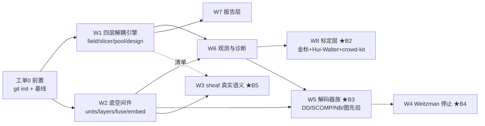

# WORK-ORDERS —— 自研件编写工单

> **版本**：v1.0 ｜ **日期**：2026-10-09 ｜ **上游**：`ARCHITECTURE.md` v0.1（§9 模块清单、§12 契约自检、§13 路线图）+ `reference/INTERFACE-CHECK.md` §5（自研边界 W1–W8）
> **性质**：执行文档。每单只含四件事——**搬什么、写什么、怎么算完、禁止什么**。不给工期，只给出口判据。
> **批次**：B1（M0 骨架）→ B2（M1 标定）→ B3（M2 解码+真仓）→ B4（M3 停止）→ B5（M4 盲区）。前一批出口判据不满足，下一批不开工。

---

## 工单 0 · 开工前置（开工当天完成）

| # | 事项 | 完成判据 |
|---|---|---|
| O1 | `topos-audit/` 执行 `git init` + 首次提交（ARCHITECTURE.md / WORK-ORDERS.md / INTERFACE-CHECK.md / .gitignore / reference 两例外文件） | `git log` 有基线提交；`git status` 干净 |
| O2 | 目录骨架落位：`topos/{core,axis,pool,infer,stop,calib,report}` + `PREREG/` + `EXP/` + `tests/` + 默认 `axes.json`（v3 空壳） | 目录树与本工单 §W1 交付物一致 |
| O3 | 推 GitHub（走 `ssh://git@ssh.github.com:443`，建仓 `master666-max/topos-audit`，MIT） | `ls-remote` 回读一致 |

**禁止**：O3 之前不得开始任何 W 编号工单（先有基线，后写代码）。

---

## B1 批 · M0 骨架

### W1 · 四层解耦引擎

| 项 | 内容 |
|---|---|
| **目标** | `axis/`（manifest+registry+methods）+ `pool/`（slicer+pool+design）四层跑通：清单 v3 → 场 → 切片 → 池 → 设计矩阵 |
| **搬**（mini-lab，均已 [M]） | `coord_mini.axis_method` 装饰器 + `AXIS_METHODS` 注册表 → `axis/registry.py`；五个方法学函数改名为 `*_field`（**防遮蔽事故重演**，REPORT §3）；`_load_patterns` → `axis/methods/regex.py`；`git_churn` → `axis/methods/git.py`；`discover_units` → `core/units.py` |
| **新写** | ① manifest v3 加载 + schema 校验（缺字段/未知 method/未知切片引用 → 报错并指名行）；② slicer 算子集 `has / gt / lt / quantile_gt / quantile_le / between_q / notnull / expand`；③ 池布尔组合（嵌套结构，ADR-A10）；④ `constraints` 强制执行（超 max_width/max_pools、低于 min_pool_size 的池**丢弃并告警**） |
| **裁决已定（ADR）** | **A10**：布尔组合用 `{"all":[]}/{"any":[]}/{"not":…}` 嵌套，叶子=切片名，**不做字符串 DSL 解析器**（零解析器、无优先级歧义）；**A11**：`expand` 算子把列表场（如 anchor 的 33 个 tag）自动展开为逐值切片；**A12**：None 是合法场值，切片对 None 单元一律排除，`notnull` 是唯一能捞回它们的算子 |
| **交付物** | `topos/axis/*.py`、`topos/pool/*.py`、默认 `axes.json`（v3：anchor 引用 `reference/anchors-bandit.json` + churn + age + loc + forman + diffusion，含 ≥1 个嵌套组合池）、`PREREG/B1.md` |
| **验收（全过才算完）** | ① `topos selftest` 契约自检 #5/6/7/8/12 全绿（映射见附录 A）；② **解耦验收**：测试脚本只改 `axes.json` 新增 2 场 + 1 组合池 → 引擎零代码改动产出该池（git diff 仅清单文件）；③ 33 个 bandit 锚点经 `expand` 全部成片，无手写声明；④ 对 mini-lab 目录建空间，池数/覆盖诊断与 space_mini v0.1 输出**同量级**（数量不必相等，口径必须可解释） |
| **禁止** | 代码出现任何具体轴名（anchor/churn/…只能出现在清单与测试里）；[U] 部件不带证伪判据合入 |

### W2 · 底空间件

| 项 | 内容 |
|---|---|
| **目标** | `core/`：单元发现 → 五类耦合边 → 融合图 → （仪表）扩散嵌入，一条链可跑 |
| **搬**（均已 [M]） | `space_mini._extract_layers / _walk_calls / _pass_through_data / _resolver` 全家 → `core/layers.py`（selftest 10/10 的合成仓断言一起搬进 `tests/`）；`coord_mini.build_call_graph / forman_curvature / _matvec_L / _jacobi_eig / diffusion_embedding` → `core/`（E1 咬合件，λ₂ 残差 1e-7）；融合图 `w=Σα·A_t` 逻辑 |
| **新写** | ① `Space.build(root, manifest)` 总装入口（替代 space_mini 里轴池焊死的 `_build_axes_and_pools`——**那 60 行整体废弃，由 W1 四层替代**）；② 对拍钩子：`--crosscheck` 开关调 `reference/_crosscheck.py` 同款逻辑（GC Forman + scipy λ₂） |
| **验收** | ① 契约自检 #1/2/3/4 全绿；② 对拍钩子实测：mini-lab 目录 154 边曲率 max\|Δ\|=0、λ₂ Δ<1e-12（沿用今日 6/6 基线）；③ `space.json` 产物含必填三诊断与 schema 版本号 |
| **如实记录** | 抽取器天花板：control=1 / return=2（N=65 样本）——写进模块 docstring，M5 Joern 校验前**不承诺**控制/返回层完备 |
| **禁止** | 为提升 control/return 召回在 B1 加启发式——那是 M5 工单，B1 保持已验证的 10/10 语义不动 |

### W6 · 观测与诊断

| 项 | 内容 |
|---|---|
| **目标** | `infer/observe.py`（带噪 OR）+ `pool/coverage.py`（三诊断）+ 模拟 oracle |
| **搬** | `coord_mini.pool_coverage`（c_min/c_mean/zero_cover）→ `pool/coverage.py`；`decode_mini.run_case` 里的 oracle 采样逻辑（真值集按 Se/Sp 撒噪）→ `infer/observe.py` |
| **新写** | 观测模型显式化：`P(y=1|D) = 1−Sp + (Se+Sp−1)·OR(d_i)`；oracle 接口 `Oracle.observe(pool, truth, se, sp, rng) -> 0/1`（合成 oracle 进 B1，真实信号源适配 B2 起） |
| **验收** | 契约自检 #9；**条款复算**：E-X1 数字在工具内可复现（球池零覆盖 ≈11.5% 量级、随机池 ≈3%，种子固定容差 ±2pp）；观测模型单元测试：Se=1/Sp=1 时退化为干净 OR |
| **禁止** | 把「覆盖率达标」写成硬闸——E-X1 v4 实测覆盖均衡≠检测最优，诊断只告警不拦截 |

### W7 · 报告层（首版）

| 项 | 内容 |
|---|---|
| **目标** | B1 只做 `report/json_out.py`：`space.json` 落盘（schema `topos-space/1`，字段表见 ARCHITECTURE §9.3） |
| **验收** | 产物带 schema 号；`c_min` / `zero_cover_rate` 缺失时抛异常（缺失=bug 不是可选）；MD/HTML 渲染推迟到 B3 |
| **禁止** | B1 阶段做任何美化输出 |

**B1 出口判据**（满足才开 B2）：契约自检 ≥12 项全绿 + 解耦验收通过 + 对拍钩子 6/6 + `topos space <dir> --check` 对 mini-lab 与一个合成仓跑通。

---

## B2 批 · M1 标定

### W8 · 标定层（**v2 降负方案**，2026-10-09 用户裁决"改"）

> **裁决记录**：v1 的"金标 300–500 全人工自标"作废。依据：Devign 花 600 人时、4 名专家、
> 两轮交叉标注，PrimeVul 复测正确率仍只有 **24%**——人工堆量既不可行也不保质。
> v2 = **五层真值套件**，人工只留 100 个仲裁单元（约 1 个周末，裁决已有证据而非盲标）。

| 层 | 真值来源 | 人工 | 作用 | 诚实条款 |
|---|---|---|---|---|
| L1 | **执行正样本库**：BugsInPy / SWE-bench patch 提取 + 测试执行验证（bug 版 FAIL_TO_PASS、修复版复绿） | 0 | 高质量正样本（数百） | 负样本 = "未标注"，非"确认干净"（PU learning 语义） |
| L2 | **变异注入召回下界**：≥5 类变异算子植入已知缺陷（NASA seeded-defect 血统，gen_repo 扩展） | 0 | 检测器召回**下界** | seeded 缺陷偏典型会高估 Se——只报下界 |
| L3 | **SVEN 锚定集**：Python 386 漏洞函数（94% 精度，CCS'23） | 0 | 金标种子层 | 只覆盖 9 个 CWE，域窄 |
| L4 | **折扣系数仲裁**：自标 100 单元（按池分层、零覆盖强制入样）；LLM 独立预标 3 遍 + **人只仲裁分歧样本**（带执行证据） | ~8h | 实测公开集在本域一致率（打折系数） | LLM 预标同源偏见（Ising W 假共识），**仲裁才是真值** |
| L5 | **Hui–Walter 潜类估计**：两个独立信号源 × 两个群体 | 0 | 无金标 Se/Sp 估计的数学兜底 | 需独立性假设；假共识用 Ising W 建模 |

| 项 | 内容 |
|---|---|
| **目标** | `calib/`：L1–L5 五层 + crowd-kit 胶水（E4）+ 温度/Platt 缩放 + 报告模板固化噪声地板声明 |
| **搬/接** | crowd-kit `DawidSkene` / `OneCoinDawidSkene`（签名已核：`fit(pd.DataFrame task/worker/label)` → `labels_` / `probas_`；依赖 pandas/attrs/sklearn 全在 venv）。加载走**包壳 shim**（INTERFACE-CHECK §2.4），失败则按源码自写精简 EM（~100 行，已批准降级路线） |
| **新写** | ① patch 提取器（diff hunk → 函数定位，判据 E-B2-2）；② 变异注入器（5 算子，判据 E-B2-3）；③ 金标 CSV 管理器（append-only、重复拒绝）；④ Hui–Walter（crowd-kit 不给混淆矩阵 CI——自补 bootstrap 95%）；⑤ 温度/Platt 缩放 |
| **预注册** | `PREREG/B2.md`（判据先于实现：E-B2-1..5 全部量化；修正案逐版披露，第 4 版停手） |
| **验收（全过才算完）** | ① E-B2-1 Hui–Walter 合成估计落真值 CI；② E-B2-2 patch 管线 ≥100 正样本 + 手工抽查全对；③ E-B2-3 变异注入 mutation score 可算且干净版不误杀；④ E-B2-4 折扣系数读数 CI 半宽 <0.15；⑤ 报告含噪声地板声明（BigVul 25% / Devign 24%） |
| **禁止** | 锚定 <100 单元时对外报"真实精度"（只许"仪器灵敏度"）；LLM 预标不经验证直接入金标；任何层冒充另一层（下界冒充召回、未标注冒充阴性） |

---

## B3 批 · M2 解码 + 真仓

### W5 · 解码器族

| 项 | 内容 |
|---|---|
| **目标** | `infer/decode.py`：DD / SCOMP / NB 三族 + 图先验宽度自适应 |
| **搬** | `decode_mini` 的 NB + 图先验（真仓 8.8× 实测件）；`power_lam_max` |
| **新写** | DD/SCOMP——**算法规范以 binGroup2 `R/` 源码为纸面基准**（GPL 不抄码，抄算法步骤，自己的实现）；图先验自适应：`α(width)` 随池宽衰减（[M] 条款"救弱不救泛"落地；衰减曲线本身 [U] → **必须预注册证伪判据**：宽池增益应 ≤1pp、窄池应 ≥+5pp，超出即修正） |
| **验收** | ① 真仓（**Python 标准库**，零下载）三解码器对照读数；② 硬排除 vs NB ≥8× 复现（audit-lab 案例口径）；③ 评估强制双指标（AUC+平衡准确率，decode run1 事故条款）；④ MD 报告渲染（W7 解锁美化） |
| **禁止** | 解码层输出二值判定；accuracy 单指标评估 |

---

## B4 批 · M3 停止

### W4 · Weitzman 最优停止

| 项 | 内容 |
|---|---|
| **目标** | `stop/weitzman.py` + `stop/budget.py`：σ 树 + 冷启动闭式 + 预算回路 |
| **新写**（mini-lab 无件，全新） | ① 每候选池 σ 求解（价值分布从当前 belief 导出）；② 冷启动闭式 `σ = w − c/θ`（[T] Weitzman 1979）；③ `topos next` CLI：输出下一个池或 STOP；④ 相关池 4.428-近似声明写进模块 docstring |
| **预注册** | `PREREG/B4.md`：判据 = 合成仓预算-召回曲线**优于固定下钻基线**（不承诺最优，[T] 相关池退化已知） |
| **验收** | 预算 8 池模拟：预算-召回曲线 ≥ 基线（两判据：同预算召回更高，或同召回预算更省） |
| **禁止** | 承诺"最优"；用未经 M1 标定的 Se/Sp 做停止决策 |

---

## B5 批 · M4 盲区

### W3 · sheaf 真实语义

| 项 | 内容 |
|---|---|
| **目标** | `core/sheaf.py`：限制映射从合成 ±1 升级为真实符号语义 |
| **搬** | `sheaf_mini.sheaf_laplacian / residuals / tv_residuals`（X5 三判据 [M] 10/10） |
| **新写** | 真实限制映射规则表：`declassify / endorse / sanitize` 等穿越动作 → ±1/约束（~~上游依赖 A 轴工单 E×D×F 接缝判定纪律——该项待你裁决（Q3），裁决前本单不开工~~ **已裁决（2026-10-10）：Q3 降标采纳**——取 E×D×F 的 L1 槽位分类 + L2 rubric 骨架做瘦身版符号规则表 v0.1 [U]，五层套件证据对拍替代双人盲裁，J6 全量纪律件留作升级路径；规则表及推导见 `PREREG/B5.md` §B，阻塞解除） |
| **验收** | 真实接缝盲区可定位（非合成用例）；X5 三判据在新语义下保持全咬合 |
| **禁止** | 跳过 A 轴工单直接猜符号规则 |

---

## W9 · 多语言后端 + Joern 离线金标校验 ★M5（2026-10-10 开单）

| 项 | 内容 |
|---|---|
| **目标** | 非 Python 仓跑通 M0–M4 链路；Joern 作**离线金标校验器**（架构书 §13 M5；SYNTHESIS Q2 裁决：不引 Joern 作主引擎） |
| **搬** | —（mini-lab 无件） |
| **新写** | ① `core/langjs.py`：JS 单元/调用边/require 边抽取（stdlib 正则级，**[U]**）+ JS seam 规则子集（R1 require=受控 conduit；R4 eval/exec 非字面量否决；R2/R3 JS 等价物缺机械信号，**诚实留白 v0.2**）；② 便携环境件（JRE21 + joern-cli Windows zip 落 `tools/`，gitignore，**不动系统 Java 1.8**）；③ `crosscheck` 扩展：Joern CPG 调用边 vs topos 抽取边的 **precision/recall 对拍报告** |
| **验收** | E-M5-1：JS 真仓（express `lib/`）三 CLI 全链零退出 + JS 单元/边读数 + sheaf 无虚假 frustration；E-M5-2：Joern 自检跑通 + bandit（Python）与 express（JS）两仓对拍报告（precision ≥0.8 设门，recall 只报数不设门——我们的边可少不可假） |
| **禁止** | Joern 主引擎化（Q2 裁决）；为 JS 上 tree-sitter/babel 重依赖（stdlib 正则 [U] 起步）；动系统 Java |

---

## 附录 A · 契约自检 12 项 → 工单映射

| # | 自检项 | 归属 |
|---|---|---|
| 1 | 单元发现正确性 | W2 |
| 2 | 五类边各一例命中 | W2 |
| 3 | 融合图权重 = Σα | W2 |
| 4 | Lanczos λ₂ 残差 < 1e-6 | W2 |
| 5 | **清单解耦验收**（仅改清单加场/切片/组合池） | W1 |
| 6 | 切片算子各 op（含全 None 场边界） | W1 |
| 7 | 布尔嵌套组合 all/any/not | W1 |
| 8 | 空池丢弃 + constraints 执行 | W1 |
| 9 | c_min / zero_cover_rate 计算 | W6 |
| 10 | sheaf frustrated → H⁰=0 | W3（B1 先挂合成版） |
| 11 | 解码输出 ∈ [0,1] 非二值 | W5 |
| 12 | 缺 git → churn/age = None（不填 0） | W1 |

## 附录 B · 全局禁止事项（红线摘录，适用于全部工单）

1. 运行时零第三方依赖（stdlib only）；外部件只存在于 `reference/` 与离线校验。
2. 代码不出现轴名（清单单源）；同一机制禁止平行实现。
3. [U] 部件必须同时落一条预注册证伪判据，否则不合入。
4. 三态口径（咬合/不咬合/登记盲区）+ 修正案逐版披露；判据改到第四版必须停手。
5. `audit-lab` 与既有工程区只读；mini-lab 冻结（只许从它**复制**，不许改它）。
6. 合成仓数字禁止外推；真仓读数用 Python 标准库。

## 附录 C · 本工单新增 ADR

| ADR | 决策 | 理由 |
|---|---|---|
| A10 | 池布尔组合用 JSON 嵌套（`all/any/not`），不用字符串 DSL | 零解析器、无优先级歧义、JSON 原生 |
| A11 | `expand` 算子自动展开列表场 | 33 个 bandit tag 免手写 33 条切片声明 |
| A12 | None 是合法场值；切片一律排除 None，`notnull` 独立捞回 | "如实降级"红线的载体（缺 git 不填 0） |
| A13 | 解码器对照评估强制 AUC + 平衡准确率双指标 | decode run1 accuracy 被 FPR 主导的事故条款 |

## 附录 D · 逐单状态注记（2026-10-10 工单核对，证据先行）

| 单 | 状态 | 证据指针 |
|---|---|---|
| O1 基线 | ✅ | bd6f92f；工作区干净（终态产物清点后） |
| O2 骨架 | ✅（落位偏差已修） | 骨架在位；`tests/test_contract.py` shim 补上；`PREREG/B1.md` 补追认版 |
| O3 GitHub | ✅（本次恢复同步） | push 后 ls-remote 回读一致 |
| W1/W2/W6/W7（B1） | ✅ 出口过 | e1b15d4；selftest 12/12 → **29/29**；`reference/crosscheck-result.json` 6/6 |
| W8 标定层（B2） | ◐ E-B2-1/2/3/5 咬合；**E-B2-4 走「缺省层如实登记」支线** | B2-E1..E5 回执；**出口豁免登记于此**：PREREG/B2 v1.5/v1.6 修订披露，α=0.187 作废 L4-control，定向锚改由 L1 承担；**L4 已转为实战采集方案**（PREREG/L4-field v1.0，2026-10-10 用户发起）：每审计一批入库 gold_l4_field.csv（RUN1 24 单元已回填，dsh 靶信号 PPV=0/15 如实）+ 负域抽查 n=10 清单待裁；**原「100 单元仲裁」撤销**（SVEN 368 对第三方参照 + RUN1 本域 24 单元两证据支撑，且不触判据修订停手线）；L3 SVEN 已接入 ✅ |
| W5 解码器（B3） | ✅（④ MD 渲染本次补做） | 27dcaa7 12.4×≥8；B3-E1/E2/E3；`report/md_out.py` + `report-md` CLI + c29 |
| W4 停止（B4） | ✅ | ac051ce；B4-E1.md；c₀=0.05（v1.4） |
| W3 sheaf（B5） | ✅ | 6841e44（Q3 降标采纳已登记于正文划线）；B5-E1/E2.md |
| W9 多语言+Joern（M5） | ✅（验收门语义以 **PREREG/M5 v1.3** 为准） | b502284→289536a；M5-E1/E2.md；v1.3 口径 py **0.9881** / js **1.0000** 双咬合（注册口径 js 不咬合的记录不回溯） |

**核对发现的落位偏差及处置**：① W2「断言搬进 tests/」实际在 `topos/selftest.py`（功能等价）→ 补 pytest shim 双入口；② W1 交付物 `PREREG/B1.md` 缺失 → 补追认版（B1 为 [M] 搬迁批无数据自由度，追认不影响证据学地位）；③ W5④ MD 渲染欠账 → 本次补做；④ 红线复核：stdlib-only / 轴名单源 / [U] 带证伪判据 / mini-lab 与既有工程区只读——**全数未破**。
